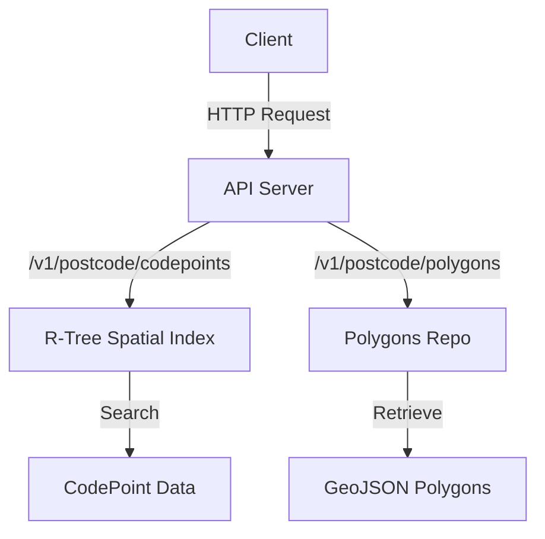
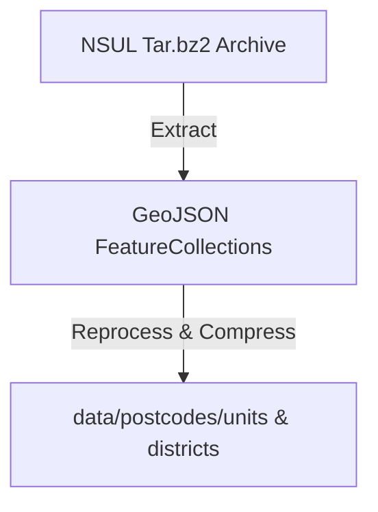

# Postcode Polygons

A high-performance Go API for spatial search and retrieval of UK postcode polygons and codepoints. It provides endpoints for querying postcode unit/district boundaries and codepoint locations, using open government and Royal Mail datasets.

## Features

-   Fast spatial search for postcode codepoints and polygons
-   REST API with bounding box queries
-   Efficient in-memory spatial index (R-tree)
-   Data extraction and reprocessing utilities
-   Caching for polygon retrieval
-   Docker support and CI/CD workflows

## Example Usage

Use the `--help` flag to show what commands are available:

```console
$ go run main.go --help
HTTP server & data extraction

Usage:
  postcode-polygons [command]

Available Commands:
  api-server   Start HTTP API server
  completion   Generate the autocompletion script for the specified shell
  extract-data Extract NSUL polygons
  help         Help about any command

Flags:
  -h, --help   help for postcode-polygons

Use "postcode-polygons [command] --help" for more information about a command.
```

### Starting the API Server

```console
$ go run main.go api-server
```

Or with custom options:

```console
$ go run main.go api-server --codepoint ./data/codepo_gb.zip --port 8080 --debug
```

Use the `--help` flag with the **api-server** command to see what options are available:

```console
$ go run main.go api-server --help
Start HTTP API server

Usage:
  postcode-polygons api-server [--codepoint <path>] [--port <port>] [--debug] [flags]

Flags:
      --codepoint string   Path to CodePoint Open zip file (default "./data/codepo_gb.zip")
      --debug              Enable debugging (pprof) - WARING: do not enable in production
  -h, --help               help for api-server
      --port int           Port to run HTTP server on (default 8080)
```

#### API Endpoints

-   `GET /v1/postcode/codepoints?bbox=<min_easting,min_northing,max_easting,max_northing>` returns a list of codepoints bound by the eastings/northings region.
-   `GET /v1/postcode/polygons?bbox=<min_easting,min_northing,max_easting,max_northing>` returns a [GeoJSON](https://geojson.org/) structure representing the postcode polygons that have codepoints inside the bounding box represented by the eastings/northings region.

### Regenerating Postcode Data (optional)

**NOTE:** this is not required for standard setup, only if you wish to regenerate the polygon data.

Download the NSUL polygons archive and extract/reprocess the data:

```console
$ mkdir data
$ curl https://postcodes-mapit-static.s3.eu-west-2.amazonaws.com/data/gb-postcodes-v5.tar.bz2 -o data/gb-postcodes-v5.tar.bz2
$ go run main.go extract-data
```

This will regenerate the data files under `./data/postcodes`.

Use the `--help` flag with the **extract-data** command to see what options are available:

```console
$ go run main.go extract-data --help
Extract NSUL polygons

Usage:
  postcode-polygons extract-data [--polygon <path>] [flags]

Flags:
  -h, --help             help for extract-data
      --polygon string   Path to NSUL polygons tar.bz2 file (default "./data/gb-postcodes-v5.tar.bz2")
```

## Architecture Overview

### High-Level Flow

#### API Server



#### Data Extraction



### Key Components

-   **main.go**: CLI entrypoint, command routing
-   **cmd/api_server.go**: API server setup, routes, middleware
-   **cmd/extract_data.go**: Data extraction and reprocessing
-   **spatial-index/**: R-tree spatial index for codepoints
-   **internal/**: Polygon repo, file operations, caching
-   **routes/**: API endpoint handlers

## Development

### Prerequisites

-   Go 1.24+
-   Data files (all these locations are checked into the git repo):
    - `data/codepo_gb.zip`,
    - `data/postcodes/units/`,
    - `data/postcodes/districts/`

Note that `codepo_gb.zip` was originally sourced from https://www.ordnancesurvey.co.uk/products/code-point-open, and will be periodically synced into this repo.

### Running Locally

1. Extract data as above
2. Start the server:

    ```bash
    go run main.go api-server
    ```

3. Query endpoints with bounding box parameters.

### Docker

Build and run with Docker:

```bash
docker build -t postcode-polygons .
docker run -p 8080:8080 postcode-polygons
```

## Testing

Run all tests:

```bash
go test ./...
```

Test coverage and reports are generated in `test-reports/`.

## TODO & Future Enhancements

-   [ ] Add OpenAPI/Swagger documentation
-   [ ] Support for additional spatial queries (e.g., nearest, within polygon)
-   [ ] More granular error handling and logging
-   [ ] Automated data updates from upstream sources
-   [ ] Add authentication/authorization for API endpoints
-   [ ] Improve Docker image size and build speed
-   [ ] Add more unit and integration tests

## License & Attribution

See `LICENSE.md` and `ATTRIBUTION.md` for further details.

