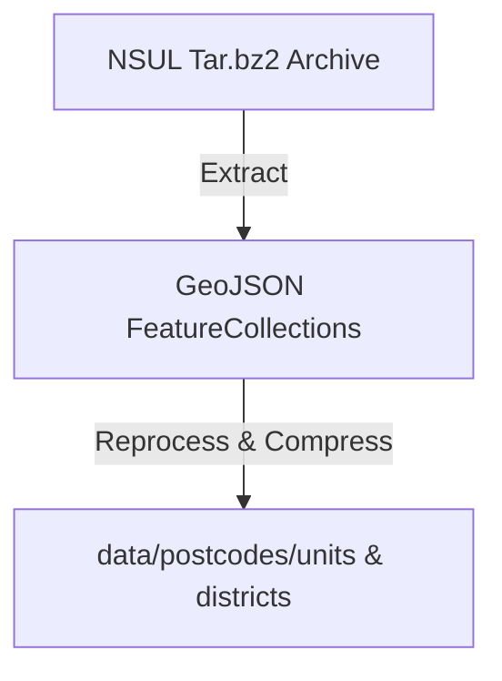

# Postcode Polygons

A high-performance Go API for spatial search and retrieval of UK postcode polygons and codepoints. It provides endpoints for querying postcode unit/district boundaries and codepoint locations, using open government and Royal Mail datasets.

## Features

-   Fast spatial search for postcode codepoints and polygons
-   REST API with bounding box queries
-   Efficient in-memory spatial index (R-tree)
-   Data extraction and reprocessing utilities
-   Caching for polygon retrieval
-   Docker support and CI/CD workflows

## Example Usage

### Data Extraction

Download the NSUL polygons archive and extract/reprocess the data:

```bash
curl https://postcodes-mapit-static.s3.eu-west-2.amazonaws.com/data/gb-postcodes-v5.tar.bz2 -o data/gb-postcodes-v5.tar.bz2
go run main.go extract-data
```

This will regenerate the data files under `./data/postcodes`.

### Starting the API Server

```bash
go run main.go api-server
```

Or with custom options:

```bash
go run main.go api-server --codepoint ./data/codepo_gb.zip --port 8080 --debug
```

### API Endpoints

-   `GET /v1/postcode/codepoints?bbox=<min_easting,min_northing,max_easting,max_northing>`
-   `GET /v1/postcode/polygons?bbox=<min_easting,min_northing,max_easting,max_northing>`

## Architecture Overview

### High-Level Flow

```mermaid
graph TD
    A[Client] -->|HTTP Request| B[API Server (Gin)]
    B -->|/v1/postcode/codepoints| C[Spatial Index (R-tree)]
    B -->|/v1/postcode/polygons| D[Polygons Repo (Memoized)]
    C -->|Search| E[CodePoint Data]
    D -->|Retrieve| F[GeoJSON Polygons]
    F -->|Serve| A
```

### Data Extraction



### Key Components

-   **main.go**: CLI entrypoint, command routing
-   **cmd/api_server.go**: API server setup, routes, middleware
-   **cmd/extract_data.go**: Data extraction and reprocessing
-   **spatial-index/**: R-tree spatial index for codepoints
-   **internal/**: Polygon repo, file operations, caching
-   **routes/**: API endpoint handlers

## Development

### Prerequisites

-   Go 1.24+
-   Data files: `data/codepo_gb.zip`, `data/postcodes/units/`, `data/postcodes/districts/`

### Running Locally

1. Extract data as above
2. Start the server:

    ```bash
    go run main.go api-server
    ```

3. Query endpoints with bounding box parameters.

### Docker

Build and run with Docker:

```bash
docker build -t postcode-polygons .
docker run -p 8080:8080 postcode-polygons
```

## Testing

Run all tests:

```bash
go test ./...
```

Test coverage and reports are generated in `test-reports/`.

## TODO & Future Enhancements

-   [ ] Add OpenAPI/Swagger documentation
-   [ ] Support for additional spatial queries (e.g., nearest, within polygon)
-   [ ] More granular error handling and logging
-   [ ] Automated data updates from upstream sources
-   [ ] Add authentication/authorization for API endpoints
-   [ ] Improve Docker image size and build speed
-   [ ] Add more unit and integration tests

## License & Attribution

MIT License. See `LICENSE.md` and `ATTRIBUTION.md` for further details.

